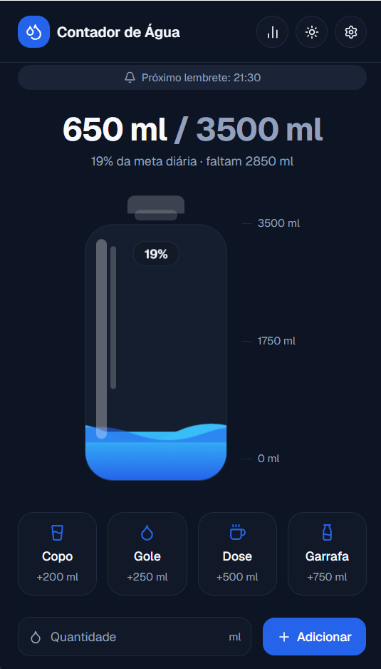
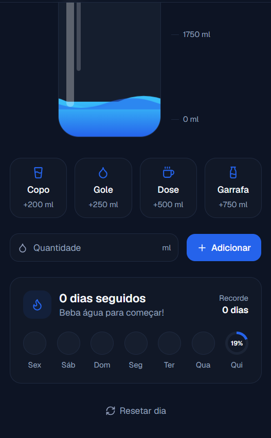
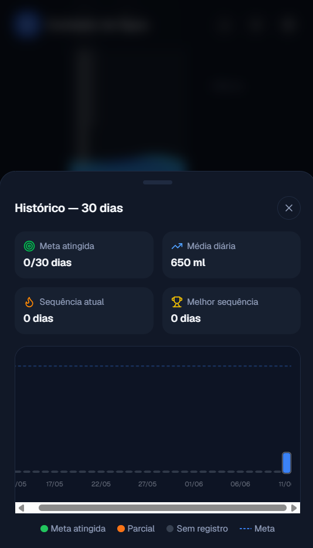

# 💧 Contador de Água

App desktop para Windows que te lembra de beber água durante o dia — ideal pra quem passa horas na frente do PC e esquece de se hidratar.





## ✨ Funcionalidades

- **Garrafa animada** que enche conforme você registra o consumo
- **Lembretes nativos do Windows** em intervalos configuráveis (padrão: 30 min)
- **Histórico de 30 dias** com gráfico de barras (meta atingida, parcial, sem registro)
- **Sequência de dias** (streak) e melhor recorde pessoal
- **Minimiza para a bandeja** — fica rodando em segundo plano sem ocupar a barra de tarefas
- **Reset automático à meia-noite** — mesmo se o PC estiver ligado, o dia vira sozinho
- **Detecta dias perdidos** — se você não abriu o app por alguns dias, eles aparecem como zero no histórico
- **Tema claro / escuro**
- **Meta e intervalo de lembrete configuráveis**

## 📥 Download

Baixe o instalador mais recente na página de [Releases](../../releases):

| Arquivo | Descrição |
|---|---|
| `Contador de Água Setup x.x.x.exe` | Instalador — instala o app, cria atalho na área de trabalho e no menu iniciar |
| `Contador de Água x.x.x.exe` | Portable — roda direto, sem precisar instalar |

## 🚀 Como usar

1. Baixe e instale o app
2. Ao abrir, a garrafa começa vazia
3. Clique nos botões (**Copo**, **Gole**, **Dose**, **Garrafa**) ou digite a quantidade manualmente
4. O app fica na bandeja do sistema — fechar a janela não encerra o programa
5. Você receberá notificações quando esquecer de beber água
6. Clique no ícone 📊 no cabeçalho para ver o histórico dos últimos 30 dias

## ⚙️ Configurações

Clique no ícone de engrenagem (⚙️) para ajustar:

- **Meta diária** em ml (padrão: 2000 ml)
- **Intervalo de lembrete** em minutos (padrão: 30 min)

## 🛠️ Tecnologias

| Camada | Stack |
|---|---|
| Interface | Next.js 16 + React 19 + Tailwind CSS v4 |
| Desktop | Electron 36 |
| Ícones | Lucide React |
| Empacotamento | electron-builder (NSIS + Portable) |
| Persistência | JSON em AppData (via IPC bridge) |

## 🧑‍💻 Desenvolvimento local

```bash
# Instalar dependências
cd desktop
pnpm install

# Rodar em modo dev (Next.js + Electron juntos)
pnpm electron:dev

# Gerar instalador Windows
pnpm electron:build
# → dist-electron/Contador de Água Setup 1.0.0.exe
```

**Requisitos:** Node.js 18+, pnpm 11+

## 🏗️ Arquitetura

| Camada | Onde | O que faz |
|---|---|---|
| **Lógica pura** | `desktop/lib/` | Tipos, constantes, cálculos de data/streak/stats, abstração de storage — sem React, sem Electron, testável isoladamente |
| **Estado React** | `desktop/hooks/useWaterState.ts` | Fino: apenas `useState`/`useEffect` + chamadas à `lib/` |
| **UI por feature** | `desktop/components/` | `bottle/`, `controls/`, `history/`, `settings/` — cada pasta cuida do próprio pedaço visual |
| **Processo principal** | `desktop/electron/` | Módulos separados: `window`, `tray`, `reminders`, `store`, `ipc` — `main.js` é só bootstrap |
| **Bridge IPC** | `desktop/electron/preload.js` | Expõe `window.electronAPI` para o React se comunicar com o processo principal |

## 📁 Estrutura do projeto

```
contador-agua/
├── desktop/                  # 🖥 App Electron + Next.js (versão atual)
│   ├── lib/                  # Lógica pura (types, constants, dates, stats, storage)
│   ├── hooks/                # useWaterState.ts — estado React fino
│   ├── components/
│   │   ├── water-tracker.tsx # Orquestrador principal
│   │   ├── bottle/           # Garrafa animada
│   │   ├── controls/         # Botões rápidos + entrada manual
│   │   ├── history/          # Modal + gráfico SVG 30 dias
│   │   ├── settings/         # Modal de meta/intervalo
│   │   └── streak-card.tsx   # Card de sequência de dias
│   ├── electron/
│   │   ├── main.js           # Bootstrap (instância única, inicialização)
│   │   ├── window.js         # Criação da janela
│   │   ├── tray.js           # Bandeja do sistema
│   │   ├── reminders.js      # Timer de lembretes + reset à meia-noite
│   │   ├── store.js          # Leitura/escrita JSON em AppData
│   │   ├── ipc.js            # Handlers IPC centralizados
│   │   └── preload.js        # Bridge window.electronAPI
│   ├── app/                  # Next.js App Router
│   ├── assets/               # icon.ico, sons, icon_source.png
│   └── public/               # Ícones web
├── legacy-python/            # 🐍 Versão Python original (somente referência)
├── docs/                     # 📸 Screenshots
└── README.md
```

## 📝 Licença

MIT © [Adrian Souza](https://github.com/Adrian9742) — use, modifique e distribua à vontade.
